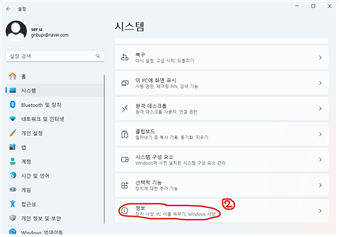
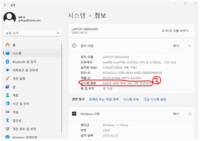
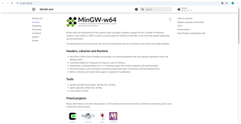
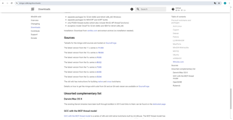
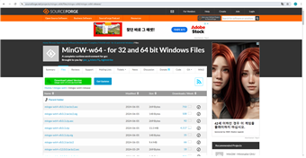
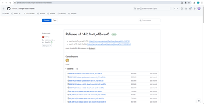
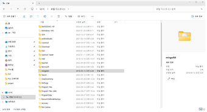
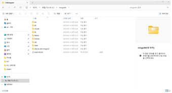
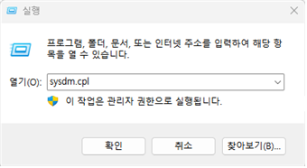
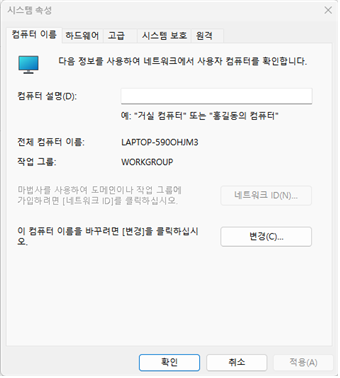

https://blog.amylo.diskstation.me/algorithm/Starting_Algorithm_with_VSCode_C++/
https://amelamel.tistory.com/7

# C++ 개발 환경 구축(window)

순서
1. PC 운영체제 확인
2. MinGW 수동 설치 (필요시)
3. MinGW Path 설정
4. VSCode 설치
5. VSCode Extension 설치
6. VSCode C++ 빌드 및 디버깅 환경 설정
7. 이외 알고리즘 연습에 도움되는 vscode extension 설치

## PC 운영체제 확인
요즘은 대부분의 컴퓨터가 64bit이나, 혹시 모르니 본인의 PC가 64 비트 운영체제인지 확인해야 한다. 
 
윈도우 검색에 설정을 검색하면, 다음과 같은 화면이 나온다. 홈 아래의 시스템 항목을 누른다. 
 
그 후 스크롤을 가장 아래까지면 정보탭을 볼 수 있다. 해당 탭을 들어간다. 
 
그 후 시스템 종류를 보면, 본인이 사용하는 PC의 사양을 볼 수 있다.

## MinGW 설치
minGW를 사용하는 이유는 VSC의 기본 설정인 cl보다 가볍기 때문이다. 
minGW를 다운받는 방법은 크게 세 가지로 잡겠다.
- sourceforge에서 정식으로 다운받는 법 (2024-10-08 기준 이 방법은 사용할 수 없었음)
- 개발자의 깃허브 링크를 통해 다운받는 법 (2024-10-08 기준 터미널 사용 불가, bits/stdc++.h 헤더파일 사용불가)
- 2024-10-08 기준까지 내가 사용하던 파일 사용

### SourceForge 사용
https://www.mingw-w64.org/ 
위의 링크는 minGW의 공식 사이트이다. 정석적으로 다운하는 방법은 다음과 같다.
 
위의 링크를 통하여 사이트에 접속해, download 탭에 접근한다.
 
스크롤을 내리다 보면, Source Forge 항목을 발견할 수 있는데, 해당 항목을 클릭한다.
 
여기서 원하는 버젼을 다운받는다. 한가지 주의할 점은 최신버전이라고 완벽한 것이 아니기에 오류가 발생할 수 있다.

### Github 사용
다음은 개발자의 Github를 통하여 다운로드 받는 법이다. 
https://github.com/niXman/mingw-builds-binaries/releases 
 
해당 항목에서 "x86_64_(버전 이름)-posix-seh"의 이름을 가진 파일을 다운받는다.

### 압축파일 사용
해당 레포토리의 ../../Setting/download 폴더안에 사용하던 minGw를 업로드 해놓았으니 사용하면 됩니다.

## MinGW Path 설정
minGW가 설치가 되었다면 환경 변수를 설정해 주어야 한다.
### 파일 위치
 
 
설치한 파일은 C:/ 경로에 옮겨두시면 됩니다.

### 환경변수 설정
 
win+R 단축키를 누르면, 윈도우의 실행 기능이 켜진다. 
실행에 sysdm.cpl을 입력한다. 
 

## VSCode 설치

## VSCode Extension 설치

## VSCode C++ 빌드 및 디버깅 환경 설정

## 이외 알고리즘 연습에 도움되는 vscode extension 설치
