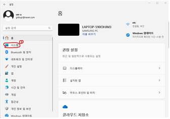

https://blog.amylo.diskstation.me/algorithm/Starting_Algorithm_with_VSCode_C++/
https://amelamel.tistory.com/7

# C++ 개발 환경 구축(window)

순서
1. MinGW 설치
2. MinGW 수동 설치 (필요시)
3. MinGW Path 설정
4. VSCode 설치
5. VSCode Extension 설치
6. VSCode C++ 빌드 및 디버깅 환경 설정
7. 이외 알고리즘 연습에 도움되는 vscode extension 설치

## MinGW 설치
요즘은 대부분의 컴퓨터가 64bit이나, 혹시 모르니 본인의 PC가 64 비트 운영체제인지 확인해야 한다.
 
윈도우 검색에 설정을 검색하면, 다음과 같은 화면이 나온다. 홈 아래의 시스템 항목을 누른다.

https://www.mingw-w64.org/ 접속

## MinGW 수동 설치 (필요시)

## MinGW Path 설정

## VSCode 설치

## VSCode Extension 설치

## VSCode C++ 빌드 및 디버깅 환경 설정

## 이외 알고리즘 연습에 도움되는 vscode extension 설치
